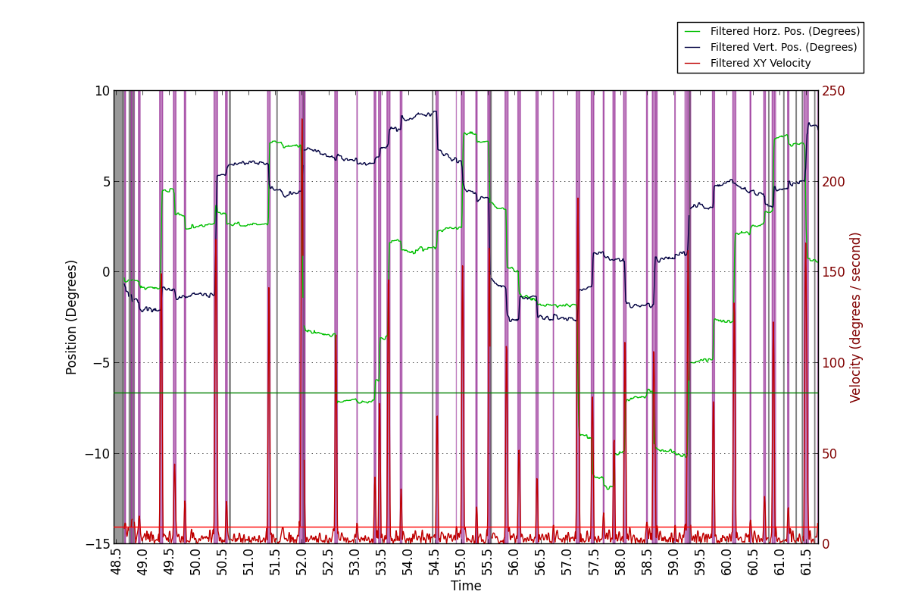
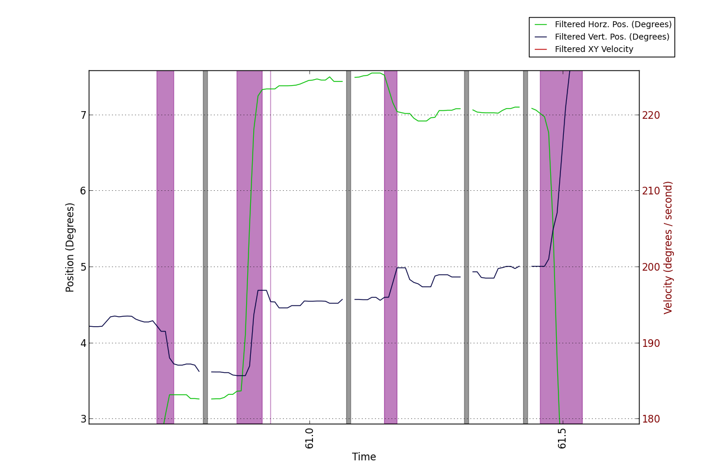

.. _dataProcessing:

Processing Recorded Eye Data
=============================

This section of the workshop will cover some common areas of eye data 
processing, including: 

1. :ref:`unitCalcs`
2. :ref:`velocityCalc`
3. :ref:`filtering`
4. :ref:`parsingEvents`

.. _unitCalcs:

**************************************
Pixel to Visual Angle Conversion
**************************************

When using PsychoPy and the ioHub the experiment creator can specify that position
information should be represented in one of several coordinate spaces, including 
pixels and visual degrees. When visual degrees are specified, stimuli are
drawn using visual degree coordinates and sizes, and position data returned by
devices capable of doing so (like the mouse or an Eye Tracker), will also
report position in visual degrees.

In some cases you may wish to use pixels for the coordinate space in your experiment,
but convert the eye position data to visual degrees after the data has been collected.
Examples of this include wanting to use a different pixel to visual degree
calculation or having incorrect or unknown eye to calibration plane distance during recording.
A fanother use case for pixel2degree conversion is when using a remote eye tracker
with the nead free and moving about. Ssome of the remote eye tracking systems available
now report the current eye to screen distance for each sample collected, and this
can be used to calculate visual degrees without using a fixed eye distance for a whole trial.

In situations like the above, using the example code provide here will allow the conversion
of pixel data to angle data; either using a fixed eye to calibration plain distance,
or a varying distance based on data in an array that is the same length as the 
pixel position data being processed. The relevent section of the example sript
is::

    # Load the ioDataStore data file
    # ....example code in many of the scripts provided ....
    #
    
    # Provide the necessary display geometry information.
    # Note that in the future this default information could be read from
    # the loaded data file so it does not need to be manually entered here.
    #
    calibration_area_info=dict(display_size_mm=(500,280.0),
                               display_res_pix=(1280.0,1024.0),
                               eye_distance_mm=550.0)

    # Use the VisualAngleCalc class defined in the common_workshop_functions to
    # generate an object that can convert data from pixel coordinates 
    # to visual angles based on the supplied calibration / display surface geometry
    # and eye distance.
    #                            
    vac=VisualAngleCalc(**calibration_area_info)
    
    # Calculate the visual degree position in x and y for the given pixel position arrays.
    # If an array of head position data is provided to the pix2deg method,
    # the degrees data will be calculated for each eye sample useing the head
    # distance reported for that sample.
    #  
    degree_x,degree_y=vac.pix2deg(pix_x,pix_y)
    
    # Do as you may with the angle data.
    # .....

A full python script which loads eye data from a iodataStore file, converts it to degrees,
and plots the pixel and degree eye position sample traces can be found at python_source/data_processing/pixels2angle.py

Example Plot
^^^^^^^^^^^^^^

Eye Position Traces in Pixel and Visual Degree Coordinates

.. image:: ./pix2deg.png
    :width: 600px
    :align: center
    :height: 400px
    :alt: Eye Position Traces in Pixel and Visual Degree Coordinates.

.. _velocityCalc:

******************************************
Velocity and Acceleration Calculation
******************************************

Velocity and Acceleration are often calculated using eye sample position data
for use in eye event parsing algorithms (well, parsers based on velocity thresholds at least ;) ).
Data is converted from pixel to visual degree coordinate space before being
passed to the velocity and acceleration algorithms.

Velocity Calculation
^^^^^^^^^^^^^^^^^^^^^^^

The following function can be used to calculate the instantaneous velocity from eye position sample data::

    def calculateVelocity(time,degrees_x,degrees_y=None):
        """
        Calculate the instantaneous velocity (degrees / second) for data points in 
        degrees_x and (optionally) degrees_y, using the time numpy array for 
        time delta information.

        Numpy arrays time, degrees_x, and degrees_y must all be 1D arrays of the same
        length.
        
        If both degrees_x and degrees_y are provided, then the euclidian distance
        between each set of points is calculated and used in the velocity calculation.

        time must be in seconds.msec units, while degrees_x and degrees_y are expected
        to be in visual degrees. If the position traces are in pixel coordinate space,
        use the VisualAngleCalc class to convert the data into degrees.
        """
        if degrees_y is None:
            data=degrees_x
        else:
            data=np.sqrt(degrees_x*degrees_x+degrees_y*degrees_y)
        
        velocity_between = (data[1:]-data[:-1])/(time[1:]-time[:-1])
        velocity = (velocity_between[1:]+velocity_between[:-1])/2.0
        return velocity

A full example python script which loaded eye data from an ioDataStore file, 
calculates the velocity for one trial of the data, and plots the result can be found in the workshop source materials: python_source/data_processing/velocity_accelleration.py

Accelleration Calculation
^^^^^^^^^^^^^^^^^^^^^^^^^^

Accelleration, or the rate of velocity change over time, can be calculated at follows::

    def calculateAccelleration(time,data_x,data_y=None):
        """
        Calculate the accelleration (degrees / second / second) for data points in 
        degrees_x and (optionally) degrees_y, using the time numpy array for 
        time delta information.
        """
        velocity=calculateVelocity(time,data_x,data_y)
        accel = calculateVelocity(time[1:-1],velocity)
        return accel 

A full example python script which loaded eye data from an ioDataStore file, 
calculates the velocity for one trial of the data, and plots the result can be found in the workshop source materials: python_source/data_processing/velocity_accelleration.py

Example Plots
~~~~~~~~~~~~~~~

Eye Angle Traces with associated XY Velocity and Accelleration Trace

.. image:: ./velocity_accelleration_plot.png
    :width: 700px
    :align: center
    :height: 400px
    :alt: Eye Angle Traces with associated XY Velocity and Acceleration Trace

Magnified Eye Angle Traces with associated XY Velocity and Acceleration Trace

.. image:: ./vel_acc_zoomed.png
    :width: 700px
    :align: center
    :height: 400px
    :alt: Magnified Eye Angle Traces with associated XY Velocity and Acceleration Trace

.. _filtering:

**************************************
Filtering Out Noise
**************************************

With any eye tracking system it is often beneficial to filter the sample data
data recorded device to:

    #. Reduce high-frequency noise from eye position data, possibly increasing precision measures.
    #. Decrease velocity and acceleration noise in the eye signal, possibly improving eye event detection (Saccades, Fixations, etc).

When using a filtering algorithm on your eye sample data, it is important to consider:

A. What effect does the filter have on the reported characteristics of the 
occulomotor behaviour:

    #. Are small saccades being removed?
    #. Is the duration, amplitude, peak velocity, or other such properties of saccades being significantly effected?
    #. Are over-shoots to target locations being exagerated?
    
B. What is the impact of the filter on the overall delay of on-line access to the eye data being reported?

C. What parameters are adjustable in the filtering algorithm, and what are the *best* settings to use? 

There is often no one right answer to the above questions and considerations. The 
experimental paradigm being run and the way in which the resulting eye data collected will
be analyzed can significantly influence what may be considered as *correct*.

With this in mind, it can be fruitful (and fun) to try different filtering algorithms and
see how each changes the data being reported; both for better or worse.

Some Example Filters
^^^^^^^^^^^^^^^^^^^^^^

All the example filters demonstrated in the workshop can be used from the same
python file. Simply uncomment the filter you wish to test and comment out
the previously active filter.

.. literalinclude:: python_source/data_processing/filters.py
    :language: python

`Butterworth Filter <http://en.wikipedia.org/wiki/Butterworth_filter>`_
^^^^^^^^^^^^^^^^^^^^^^^^^^^^^^^^^^^^^^^^^^^^^^^^^^^^^^^^^^^^^^^^^^^^^^^^^

Unfiltered vs. Butterworth Filtered Eye Position Data

.. image:: ./butter_filter.png
    :width: 600px
    :align: center
    :height: 400px
    :alt: Unfiltered vs. Butterworth Filtered Eye Position Data 
    
`Gaussian Filter <http://en.wikipedia.org/wiki/Gaussian_filter>`_
~~~~~~~~~~~~~~~~~~~~~~~~~~~~~~~~~~~~~~~~~~~~~~~~~~~~~~~~~~~~~~~~~~~~~~~~~~~~~~~~~

Unfiltered vs. Gaussian Filtered Eye Position Data

.. image:: ./gauss_filter.png
    :width: 600px
    :align: center
    :height: 400px
    :alt: Unfiltered vs. Gaussian Filtered Eye Position Data 

`Median Filter <http://en.wikipedia.org/wiki/Median_filter>`_
~~~~~~~~~~~~~~~~~~~~~~~~~~~~~~~~~~~~~~~~~~~~~~~~~~~~~~~~~~~~~~~~~~~~~~~~~~~~~~~~~

Unfiltered vs. Median Filtered Eye Position Data

.. image:: ./median_filter.png
    :width: 600px
    :align: center
    :height: 400px
    :alt: Unfiltered vs. Median Filtered Eye Position Data 

`Savitzky Golay Filter <http://en.wikipedia.org/wiki/Savitzky%E2%80%93Golay_filter_for_smoothing_and_differentiation>`_
~~~~~~~~~~~~~~~~~~~~~~~~~~~~~~~~~~~~~~~~~~~~~~~~~~~~~~~~~~~~~~~~~~~~~~~~~~~~~~~~~~~~~~~~~~~~~~~~~~~~~~~~~~~~~~~~~~~~~~~~~~~~~~~~~~~~~~~~~~~~~~~~~~~~~~~~~~~~~~~~~~
Unfiltered vs. Savitzky Golay Filtered Eye Position Data

.. image:: ./sg_filter.png
    :width: 600px
    :align: center
    :height: 400px
    :alt: Unfiltered vs. Savitzky Golay Filtered Eye Position Data 

`Weighted Moving Average Filter <https://en.wikipedia.org/wiki/Moving_average#Weighted_moving_average>`_
~~~~~~~~~~~~~~~~~~~~~~~~~~~~~~~~~~~~~~~~~~~~~~~~~~~~~~~~~~~~~~~~~~~~~~~~~~~~~~~~~~~~~~~~~~~~~~~~~~~~~~~~~~~~~~~~~~~~~~~~~~~~~~~~~~~~~~~~~~~~~~~~~~~~~~~~~~~~~~~~~~

Unfiltered vs. Weighted Moving Average Filtered Eye Position Data

.. image:: ./average.png
    :width: 600px
    :align: center
    :height: 400px
    :alt: Unfiltered vs. Weighted Moving Average Filtered Eye Position Data 

.. _parsingEvents:

********************************************
Parsing Eye Sample Data into Eye Events
********************************************

Here we will look at an Eye Events Parser (or a good start to one at least). 
This is not a *suggested* parser, or the *best* parser, infact it may be a *crappy* parser. 
**This is an in development event parser.**
More testing from different eye trackers and data sets is needed before anything
can be said about how well the following approach works and further processing steps
are needed before itis complete. 

With that said, the results of the implementation so far do look very promising.

Notes:
^^^^^^^

#. Will handle monocular data.
#. Use a Velocity / Accelleration based Parsing Model.
#. Filter data streams as needed.
#. Use some heuristics to identify possible false alarms (not yet implemented)
    
    #. Maximum Realistic Velocity and Accelleration values
    #. Peak Velocity Point within Saccade Candidates
    #. Minimum / Maximum Event Durations
    #. Others ??
    
#. Focus on creating an off-line parser. An on-line version can be homework. ;)

Parser Algorithm
^^^^^^^^^^^^^^^^^

The basic steps that have been implemented so far are:

1. Load sample data from an iodataStore File in pixel coordinates (ideally unfiltered data)
2. Process the sample data on a trial by trial basis:

    A. Deal with any periods of missing eye position data (from blinks, tracking loss, etc). Such gaps in the x or y position data are filled in by a linear interpolation algorithm. This *fill in* is only temporary, kept in place duing the data filtering stages only.
    B. Convert pixel position data into visual angle based data.
    C. Filter the eye position data (in visual degree coordinates) using the Median Filter shown earlier. The appropriate window size forthe filter will depend on the sampling rate the eye tracker was running at and the general baseline level of the system. The Median Filter seems to do an excellent job of removing high frequency impulse noise from eye position traces, with a relatively small window size, while keeping the profile of the eye data tracing very intact.
    D. Calculate the Velocity of the filtered eye position data.
    E. Filter the velocity data obtained. I ended up using a two pass butterworth filter with a Wn of .3 and an order of two. In theory, any of the filters demonstrated earlier can be used here. More experimentaion should be done to see which filter types provide good results.

3. Following the above steps, the time periods where the gap fill in was appied are marked as missing data sample periods so they can be later marked as blink events or possibly general eye tracking loss periods.
4. The next step is to calculate the velocity threshold (VT) to use for determining periods in the eye position stream that should be considered as saccade candidates. Instead of using a fixed VT as is often done, an algorithm adopted from *An adaptive algorithm for fixation, saccade, and glissade detection in eyetracking data, MARCUS NYSTRÖM AND KENNETH HOLMQVIST, Behavior Research Methods (2010)*, is used to find the most appropriate VT in an adaptive fashion for each trial in the data file. At a high level, the algorithm:

    A. Starts with a velocity threshold (VT) equal to 3*std() of the velocity data for the trial being processed. This way even the initial VT does not need to be manually set or guessed. 
    B. The VT is then iteratively adjusted based on velocity data statistics for any time periods which are still below the current VT level. Based on the very small data set used while working on the parser, VT is adjusted by the current mean velocity level that is below VT, plus 3.0*std() of the below VT data.
    C. The iteration stops when the difference between the current VT and previously calculated VT is less than one degree. 
    
The current python implementation of the adaptive velocity threshold calculation; based on NYSTRÖM AND HOLMQVIST (2010)::

    def calculateVelocityThresholdPerTrial(trial_data_streams):
        for t,trial_data in enumerate(trial_data_streams):        
            pt_list=[]        
            missing_data_mask=trial_data['missing_data_mask']
            valid_velocity_filtered=trial_data['velocity_filtered'][~missing_data_mask[1:-1]]
            
            # Initial velocity theshold to use for the trial.
            #
            PT=valid_velocity_filtered.min()+np.array(valid_velocity_filtered,dtype=float64).std()*3.0
            velocity_below_thresh=valid_velocity_filtered[valid_velocity_filtered<PT]
            PTd=2.0
            # While the difference between the current velocity threshold and last threshold is greater than a degree
            #
            while PTd >= 1.0:   
                if len(pt_list)>0:
                    # Calculate the new velocity threshold for the current below threshold velocity point population.
                    #
                    PT=velocity_below_thresh.mean()+3.0*np.array(velocity_below_thresh,dtype=float64).std()
                    
                    # Update the points in the velocity stream which are still below the new threshold.
                    #
                    velocity_below_thresh=valid_velocity_filtered[valid_velocity_filtered<PT]
                    PTd=np.abs(PT-pt_list[-1])
                # Keep a record of the threshold values calculated during the iteration process.
                #
                pt_list.append(PT)

            # Identify regions of the trial time series which should be considered
            # as saccade candidates, as they have velocity values about the final settled VT.
            #            
            saccade_candidate_mask=(trial_data['velocity_filtered']>=PT)
            saccade_candidate_mask[missing_data_mask[1:-1]]=0
            saccade_candidate_periods=np.ma.extras.notmasked_contiguous(
                                    np.ma.array(trial_data['velocity_filtered'],
                                                mask=saccade_candidate_mask)
                                    )                                
        
            trial_data['velocity_threshold_points']=np.asarray(pt_list)
            trial_data['saccade_candidate_mask']=saccade_candidate_mask
            trial_data['saccade_candidate_periods']=saccade_candidate_periods

The full parser source as it stands now is available in python_source/data_processing/data_processing.py

Example Eye Data for One Trial Including Parsed Missing Data and Saccade Candidate Regions
^^^^^^^^^^^^^^^^^^^^^^^^^^^^^^^^^^^^^^^^^^^^^^^^^^^^^^^^^^^^^^^^^^^^^^^^^^^^^^^^^^^^^^^^^^^^
    #. **Grey Vertical bars** in the plot represent periods of missing eye position data
    #. **Purple Vertical bars** in the plot represent Saccade Candidates
    #. The **Green horizontal line** spanning the full x axis is the starting point for the velocity thresold.
    #. The **Red horizontal line** spanning the full x axis is the end velocity threshold after the adaptive thresholding iterations. The algorithm clearly settles the velocity threshold to a value just above the general noise level that remains in the velocity data for the trial.
    

    
Two Seconds of a Trial Showing Parsed Saccade Candidate Regions.
^^^^^^^^^^^^^^^^^^^^^^^^^^^^^^^^^^^^^^^^^^^^^^^^^^^^^^^^^^^^^^^^^
.

.. image:: ./2_sec_parsed.png
    :width: 600px
    :align: center
    :height: 400px
    :alt: Two Seconds of a Trial Showing Parsed Saccade Candidate Regions. 

A period During a Trial Where Missing Data Periods are Mixed with Saccade Canidate Regions. Are they Real? 
^^^^^^^^^^^^^^^^^^^^^^^^^^^^^^^^^^^^^^^^^^^^^^^^^^^^^^^^^^^^^^^^^^^^^^^^^^^^^^^^^^^^^^^^^^^^^^^^^^^^^^^^^^^^
.

